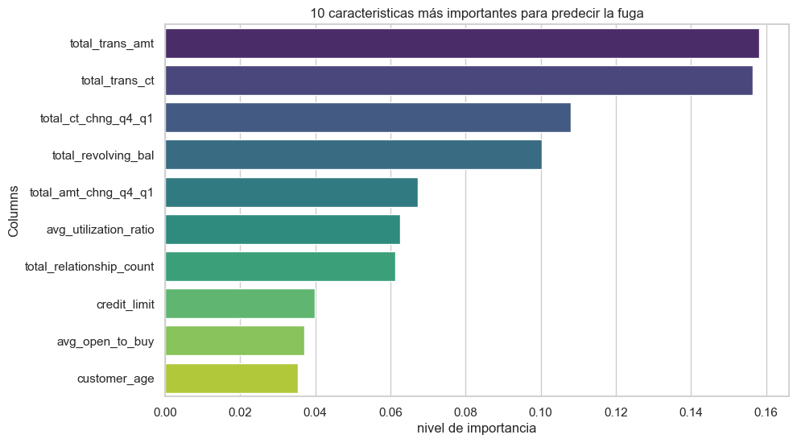
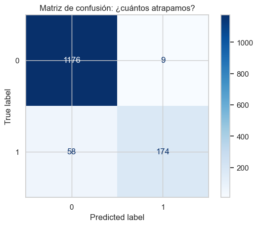

# 📊 Predicción de Fuga de Clientes (Bank Churn Prediction)

## 📌 Introducción del Proyecto
En el sector financiero, la retención de clientes es una de las estrategias más rentables. Este proyecto se enfoca en el análisis y predicción de la **tasa de deserción (Churn)** de clientes de tarjetas de crédito.

Utilizando un dataset de más de 10,000 registros, he desarrollado un modelo de clasificación capaz de identificar patrones de comportamiento que preceden a la cancelación de una cuenta. El objetivo principal es proporcionar al equipo de marketing una herramienta predictiva que permita realizar intervenciones proactivas.

### 🎯 Objetivos Clave:
* **Identificar** los factores críticos que impulsan la fuga de clientes.
* **Construir** un modelo robusto con un equilibrio óptimo entre precisión y cobertura (Recall).
* **Traducir** los hallazgos técnicos en recomendaciones estratégicas de negocio.

---

## 📈 Resultados y Visualizaciones

### Importancia de las Características

### Matriz de Confusión

